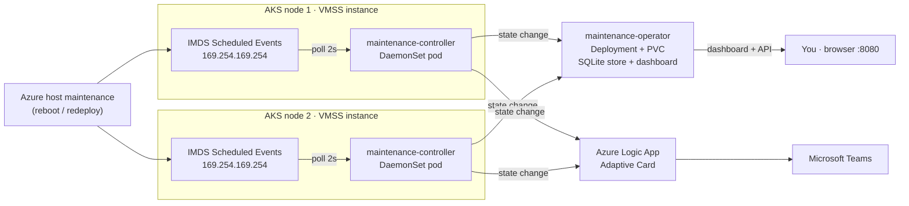
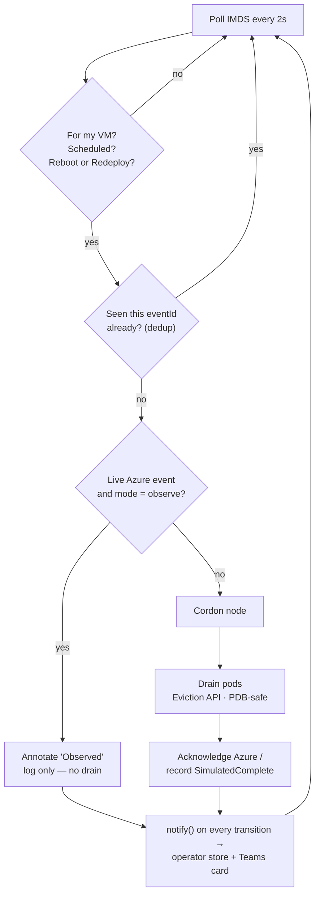
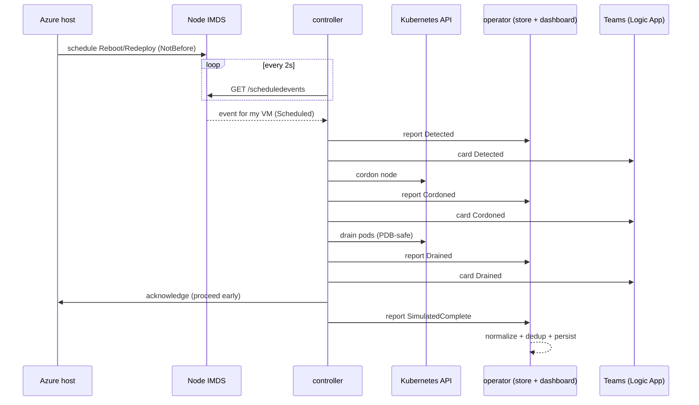
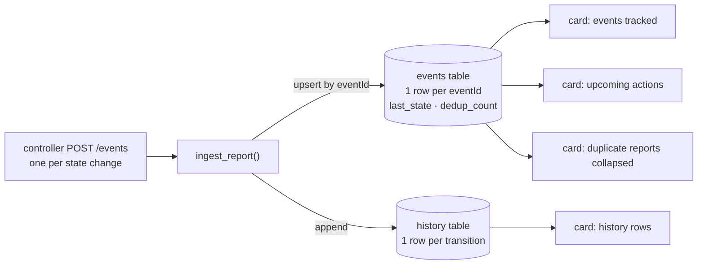
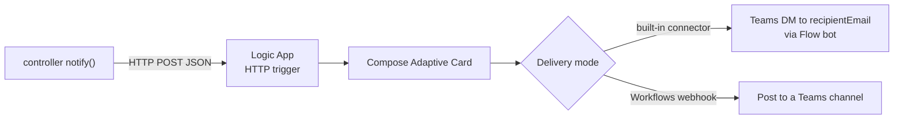

# AKS Node Maintenance Awareness Demo

When Azure needs to reboot, redeploy, or repair the physical host under an AKS
node, the node can be pulled out from under running pods with little warning.
This demo detects that maintenance **before** it happens and protects the
workload automatically — it cordons the node, drains the pods safely, records
the event, and (optionally) posts a Microsoft Teams card.

## What it covers

- **Detect** upcoming host maintenance from Azure **IMDS Scheduled Events**,
  read locally on each AKS node.
- **Act** only on the events that actually disrupt a node: `Reboot` and
  `Redeploy`. Everything else is logged and ignored.
- **Protect** the workload: cordon the node, then drain it using the Kubernetes
  Eviction API so Pod Disruption Budgets are honored.
- **Schedule** the cordon a configurable lead time ahead of the maintenance
  window instead of reacting at the last second.
- **Record** every event and state change in a persistent store with a
  de-duplicated audit trail and a live dashboard/API.
- **Notify** an external system (Teams / ServiceNow / Google Chat) on each
  state change.

## How it works

Two components split the job:

**`maintenance-controller`** — a DaemonSet, one pod per node.
- Polls the node-local IMDS Scheduled Events endpoint every 2 seconds.
- Filters events to its own VM and acts only on `Reboot` / `Redeploy`.
- Cordons the node, drains the demo namespace, and records progress as node
  annotations and structured logs.
- Reports every state change to the operator and to the notification webhook.

**`maintenance-operator`** — a Deployment with a persistent volume.
- Receives a state-change report from every controller (the fleet-wide
  aggregation point).
- Stores normalized events + action history in SQLite and de-duplicates repeats.
- Serves a live dashboard and JSON API (`/`, `/api/events`, `/api/upcoming`,
  `/api/history`).

**Architecture:**



**How the controller decides (per node):**



**End-to-end sequence:**



**Why IMDS Scheduled Events:** Scheduled Events is a typed, ahead-of-time notice
of a specific action (`Reboot` / `Redeploy`) on a specific VM. Azure never emits
one for autoscaler scale-in or other routine VMSS activity, so acting on it can't
cordon healthy nodes. This demo uses Scheduled Events as its only trigger.

## What it accomplishes

- Pods are moved off a node **before** Azure takes it down, instead of being
  disrupted mid-maintenance.
- Autoscaler scale-in and other routine platform noise never trigger a cordon.
- Every maintenance action is captured, de-duplicated, and auditable.
- Operators get proactive awareness via a dashboard and optional Teams alerts.

## Safety defaults

- Live Azure events are **observe-only** by default; nothing is acted on until
  `LIVE_ACTION_MODE` is set to `act`.
- Only the `aks-maintenance-demo` namespace is drained.
- The demo never modifies the AKS-managed VM Scale Set.

> The controller installs its Python dependencies at pod start to avoid needing a
> container registry. A production build should use an immutable, scanned image,
> durable external storage, scoped RBAC, alert retry/dead-letter handling, and a
> tested full-node drain policy.

## Azure resources

| Item | Value |
| --- | --- |
| Resource group | `aks-maintenance-demo-rg` |
| AKS cluster | `aks-maintenance-demo` |
| Region | `westus2` |
| Nodes | 2 x `Standard_D2als_v7` |

## Deploy

```powershell
git clone https://github.com/bbabcock1990/AKS-IMDS-Resource-Health-Node-Awareness-Demo.git
Set-Location AKS-IMDS-Resource-Health-Node-Awareness-Demo
.\deploy.ps1
```

## Run the demo

> For a full presenter walkthrough with per-step talk tracks *and* the command
> reference, see **`DEMO-GUIDE.md`**.

```powershell
.\demo.ps1
```

The script:

1. Shows the initial node and pod placement.
2. Injects a simulated `Redeploy` Scheduled Event.
3. Waits for the affected node to be cordoned.
4. Shows the demo pods moving to the other node.
5. Displays the controller audit log.
6. Clears the event and safely uncordons the node.

Use `.\status.ps1` to inspect the environment at any time.

## Advanced scenarios

```powershell
# IMDS Reboot/Redeploy end to end, with the operator store and dedup:
.\demo-reboot.ps1                 # or: .\demo-reboot.ps1 -EventType Redeploy

# Lead-time scheduling: controller holds, then acts leadSeconds before the window:
.\demo-leadtime.ps1 -WindowSeconds 120 -LeadSeconds 60

# Live operator dashboard + API:
kubectl port-forward -n aks-maintenance-demo svc/maintenance-operator 8080:8080
# then open http://localhost:8080/
```

## How the dashboard works

The operator is a single pod that **only listens** — it polls nothing and makes no
Kubernetes calls. Every controller in the fleet `POST`s a small JSON report to the
operator's `/events` endpoint **once per state change** (`Detected`, `Cordoned`,
`Drained`, `SimulatedComplete`, or `Observed`). The operator writes each report
into two SQLite tables on its persistent volume and serves a page that
auto-refreshes every 5 seconds.



**Two tables, two jobs:**

- **`events`** — the *current* state of each maintenance event. One row per unique
  `eventId`. Repeat reports for the same event don't add rows; they update
  `last_state` / `last_seen` and increment `dedup_count`. This is the
  de-duplicated "what's happening now" view.
- **`history`** — an append-only *audit trail*. One row for every transition ever
  received, so you can replay exactly what happened and when.

**The four cards, and where each number comes from:**

| Card | Meaning | Source |
| --- | --- | --- |
| **events tracked** | distinct maintenance events seen | row count of `events` |
| **upcoming actions** | events whose `notBefore` is still in the future *and* that haven't reached `SimulatedComplete` / `Acknowledged` | `query_upcoming()` |
| **history rows** | total transitions recorded (audit trail) | row count of `history` |
| **duplicate reports collapsed** | how many repeat POSTs were folded into existing rows | sum of `dedup_count − 1` over `events` |

**The three tables:**

- **Upcoming maintenance actions** — the subset of events still ahead of their
  window.
- **Tracked maintenance events** — every event with its `source`, current `state`,
  last-seen time, and `reports` count (that's `dedup_count`).
- **Action history** — the raw audit trail, newest first.

> **Why "upcoming" can still show 1 right after a failover:** "upcoming" means
> *future window and not yet complete* — not *not yet started*. An event that was
> cordoned ahead of a window that hasn't arrived yet stays listed until either its
> `notBefore` time passes (it then drops off automatically) or it reports
> `SimulatedComplete`. A *different* event finishing does not clear it.

**See it yourself:**

```powershell
kubectl port-forward -n aks-maintenance-demo svc/maintenance-operator 8080:8080
# then open http://localhost:8080/  (or hit the JSON API directly):
Invoke-RestMethod http://localhost:8080/api/events   | Format-Table event_id,event_type,target_node,last_state,dedup_count
Invoke-RestMethod http://localhost:8080/api/upcoming
Invoke-RestMethod http://localhost:8080/api/history  | Select-Object -First 10
```

Because the store lives on a **PersistentVolume**, the history survives operator
pod restarts.

## Notifications (Teams / ServiceNow / Google Chat)

On every state change the controller POSTs a JSON payload to a webhook. A ready-
made **Teams** pipeline (Azure Logic App → Adaptive Card) is included and stands
in for ServiceNow or Google Chat.



A card fires once per state change, only for `Reboot` / `Redeploy` events. It is
wired automatically by `deploy.ps1`, so `demo.ps1` sends notifications with no
extra step. In the default (built-in Teams connector) mode the card is sent as a
**DM to the recipient**, which defaults to your **currently signed-in user**
(`az account show` → `user.name`). Override it with `-RecipientEmail`:

```powershell
# Full deploy, DM the card to a specific person:
.\deploy.ps1 -RecipientEmail "you@yourdomain.com"
# or, if the cluster is already up, (re)wire just the notification recipient:
.\deploy-notifications.ps1 -RecipientEmail "you@yourdomain.com"
```

```powershell
# Deliver real cards to a Teams channel (create a Teams 'Workflows' webhook first):
.\deploy.ps1 -TeamsWebhookUrl "<workflows-url>"
# or, if the cluster is already up:
.\deploy-notifications.ps1 -TeamsWebhookUrl "<workflows-url>"

# Test the pipeline on its own (no drain needed):
.\test-notification.ps1 -State Cordoned
```

To target ServiceNow or Google Chat, swap the final action in
`notifications\teams-logicapp.json`. See `DEMO-GUIDE.md` **Step 8**.

## Cleanup

```powershell
.\cleanup.ps1
```

Deletes the Azure resource group (stopping all compute charges) and keeps this
folder.
